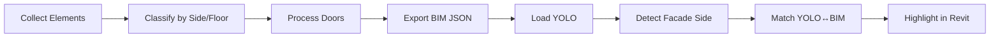

# YOLO-BIM Matcher
> Automated matching of YOLO detections to Revit BIM elements

[](https://www.python.org/) [](https://www.autodesk.com/products/revit/) [](http://pyrevitlabs.github.io/pyRevit/)

---

## 🏗️ Architecture

```
detector/
├── script.py           # Main pipeline orchestrator
├── config.py           # Configuration & constants
├── core.py             # Geometry utilities
├── classification.py   # Element classification
├── export.py          # BIM export & YOLO matching
└── visualization.py   # Revit highlighting
```

### Pipeline Flow



**Steps:**
1. **Collection** → Gather doors, windows, panels
2. **Classification** → Assign to sides (A/B/C/D), floors, interior/exterior
3. **Door Processing** → Group components (optional)
4. **BIM Export** → Generate structured JSON
5. **YOLO Loading** → Load computer vision detections
6. **Side Detection** → Classify which facade
7. **Matching** → Link detections to elements
8. **Visualization** → Color-code in Revit

---

## ✨ Features

- 🎯 **Smart Classification** - Automatically assigns elements to facade sides and floors
- 🏢 **Interior/Exterior Separation** - Distinguishes perimeter from interior elements
- 🔗 **YOLO Integration** - Links computer vision to BIM geometry
- 📊 **Structured Export** - JSON output with normalized coordinates
- 🎨 **Visual Feedback** - Color-coded element highlighting
- 📈 **Enhanced Logging** - Detailed statistics and timing

---

## 📁 Paths

Configure in `config.py`:

```python
BASE_DIR = r"C:\Users\ma3589\OneDrive - The University of Waikato\Desktop\Topic 3"
PYREVIT_DATA = os.path.join(BASE_DIR, "Pyrevit", "Data_saves")
VALIDATION_DIR = os.path.join(BASE_DIR, "Validation_Output_test", "Step.2")
```

### Input
- `{VALIDATION_DIR}/detected_objects.json` - YOLO detections

### Outputs (saved to `{PYREVIT_DATA}/Door_detections/`)
- `bim_export.json` - Structured BIM geometry
- `yolo_bim_matches.json` - Detection matches
- `side_objects_summary.json` - Classification summary
- `side_element_sequences.json` - Ordered sequences

---

## ⚙️ Configuration

```python
# Interior/Exterior Detection
EXTERIOR_DISTANCE_THRESHOLD_MM = 500.0  # Distance from perimeter
FILTER_INTERIOR_ELEMENTS = True         # Track int/ext status

# Component Grouping
GROUP_PANEL_COMPONENTS = False   # Group 4 sub-panels → 1 panel
GROUP_DOOR_COMPONENTS = False    # Group studs+headers → assemblies

# Side Classification Weights
SIDE_WEIGHTS = {
    "door": 3.0,
    "windows": 2.0,
    "wall_panels": 1.0
}

# Logging
Log.VERBOSE = True       # Standard output
Log.DEBUG = False        # Debug details
Log.SHOW_STATS = True    # Execution summary
```

**Facade Mapping:**
```
       D (Top)
       ┌─────┐
   A   │     │   C
(Left) │     │ (Right)
       └─────┘
       B (Bottom)
```

---

## 🎨 Color Coding

### By Side
- 🔴 **Side A** (Left) - Red
- 🟢 **Side B** (Bottom) - Green
- 🔵 **Side C** (Right) - Blue
- 🟡 **Side D** (Top) - Yellow

### By Floor
- 🔵 **Floor 1** - Cyan
- 🟣 **Floor 2** - Magenta

### By Type
- 🟠 **Doors** - Orange

---

## 📚 API Reference

### Core Utilities (`core.py`)

```python
dims(element, view)
# Returns: (width, depth, height, xmin, xmax, ymin, ymax, zmin, zmax) or None

is_exterior_element(dims_tuple, bounds)
# Returns: True if element is on exterior perimeter

mid_xy(dims_tuple)
# Returns: (center_x, center_y)

center_z(dims_tuple)
# Returns: center_z coordinate
```

### Classification (`classification.py`)

```python
classify_all_panels(panel_elems, view)
# Returns: (side_summary, bounds, floor_split, panel_groups)

classify_windows(window_elems, view, bounds, side_summary)
# Assigns windows to sides, modifies side_summary in-place

classify_doors(door_groups, bounds, side_summary, panel_groups)
# Returns: (door_side_map, door_interior_map)

classify_side_smart(cx, cy, bounds, is_interior=False)
# Returns: "A", "B", "C", or "D"
```

### Export (`export.py`)

```python
export_bim_geometry(doc, view, side_summary, door_output, 
                   door_side_map, door_interior_map, 
                   floor_split, panel_groups, bounds)
# Returns: Structured export dict with 'exterior' and 'interior' zones

match_yolo_to_bim(yolo_detections, bim_export, classified_side)
# Returns: List of match records [{yolo_id, label, bim_id, bim_tag, ...}]

load_yolo()
# Returns: List of YOLO detection dicts

save_yolo_matches(matches, classified_side, score)
# Saves matching results to JSON
```

### Visualization (`visualization.py`)

```python
highlight_panels_by_side(side_summary, doc, view, highlight_only=None)
# Color-codes panels by facade side

highlight_panels_by_floor(side_summary, doc, view, 
                         highlight_only=None, floor_only=None)
# Color-codes panels by floor level

highlight_doors(door_output, doc, view, filter_ids=None)
# Highlights door components in orange
```

---

## 📦 Installation

1. Install [pyRevit](http://pyrevitlabs.github.io/pyRevit/)
2. Clone to pyRevit extensions folder
3. Update paths in `config.py`
4. Place YOLO detections at configured path
5. Reload pyRevit

---

## 🚀 Usage

1. Open Revit model in 3D view
2. Run YOLO-BIM Matcher from pyRevit toolbar
3. Review console output
4. Check highlighted elements

**YOLO Format:**
```json
[
  {
    "id": 1,
    "label": "door",
    "floor": 1,
    "center_xy_norm": [0.45, 0.62]
  }
]
```

---

**Made for AEC industry** | [Report Issues](https://github.com/yourusername/yolo-bim-matcher/issues)
